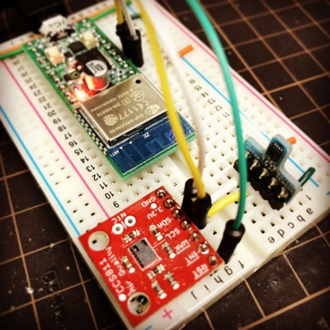
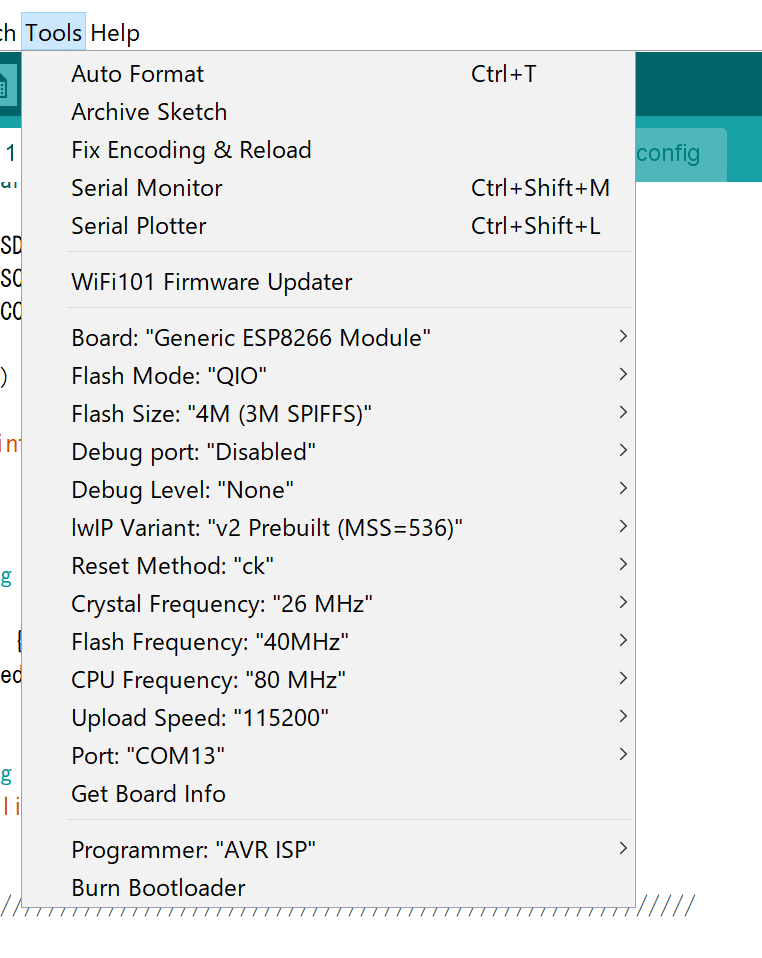

mqtt-ccs811-pub
====

  - 

Requirements
----

  - Akiduki ESP-WROOM-02 development board
    - http://akizukidenshi.com/catalog/g/gK-12236/
  - SparkFun Air Quality Breakout - CCS811
    - https://www.sparkfun.com/products/14193
  - Akiduki SHT31 module
    - http://akizukidenshi.com/catalog/g/gK-12125/
  - Arduino Client for MQTT
    - https://github.com/knolleary/pubsubclient/
  - Adafruit_SHT31
    - https://github.com/adafruit/Adafruit_SHT31

How to
----

    $ git clone https://github.com/yoggy/mqtt-sht31-ccs811.git
    $ cd mqtt-sht31-ccs811
    $ cp config.ino.sample config.ino
    $ vi config.ino
    
      # edit wifi_ssid, wifi_password, mqtt_server, mqtt_publish_topic, ... etc    
    $ open mqtt-sht31-ccs811.ino

settings for Akiduki ESP-WROOM-02 development board

  - 

Copyright and license
----
Copyright (c) 2018 yoggy

Released under the [MIT license](LICENSE.txt)
